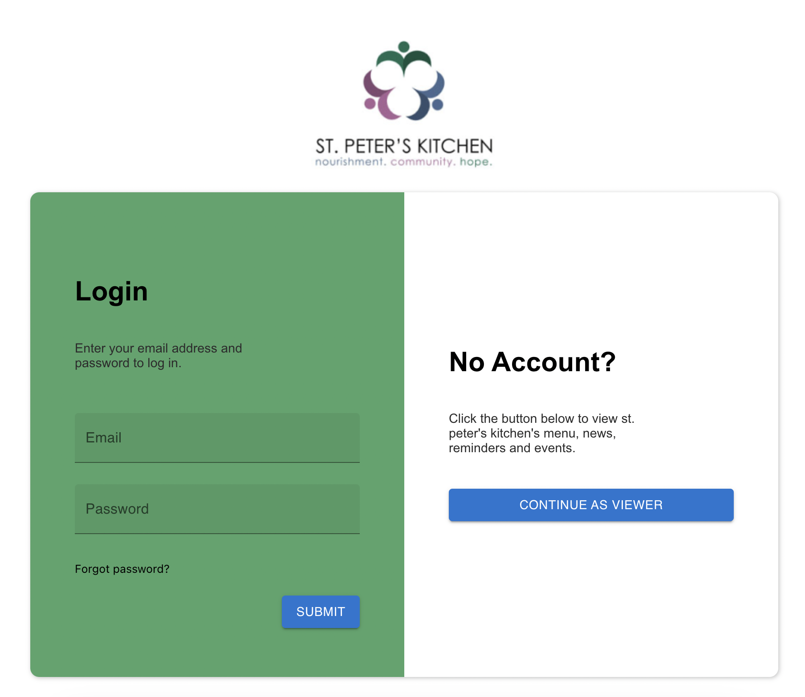
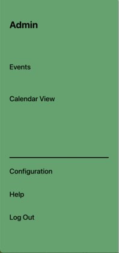
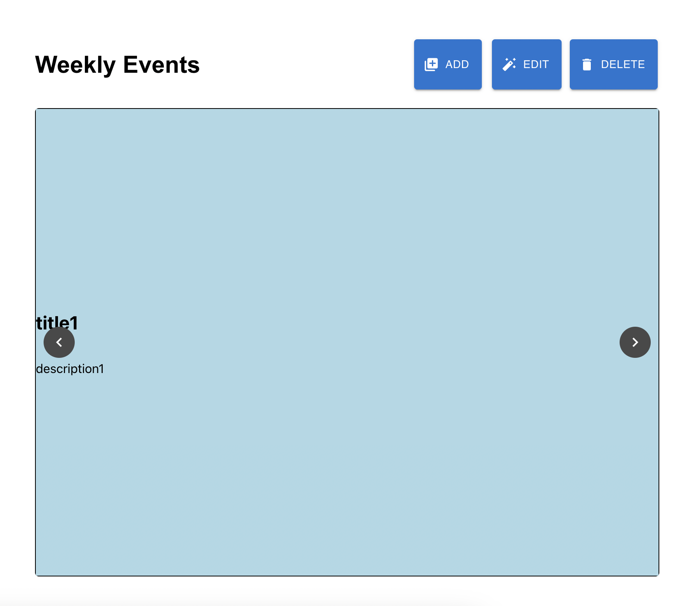
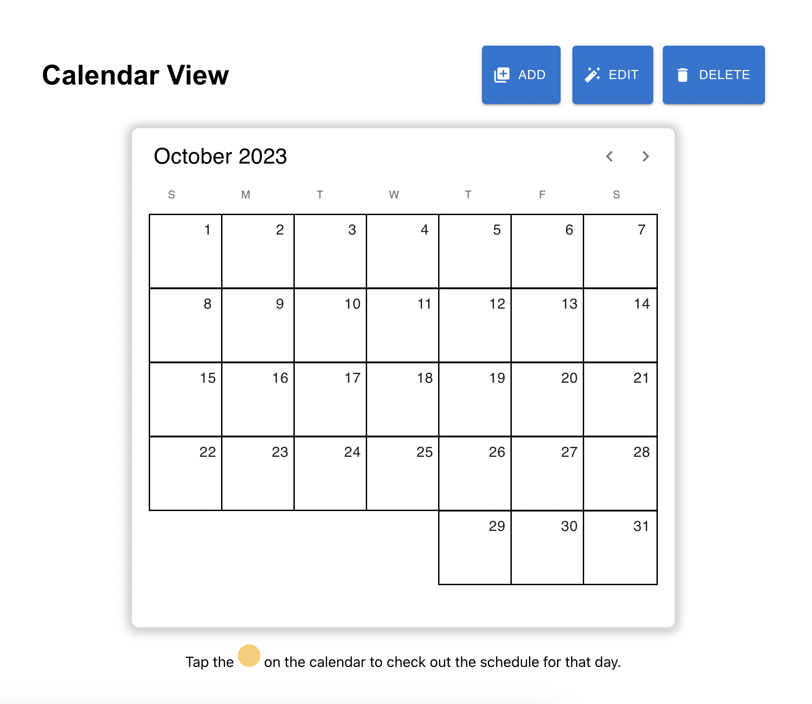

# St. Peter's Kitchen Digital Sign Help

Welcome to the help page! All your questions should be answered here.
If you have any additional questions, please contact the application administrator.

## Logging In

This page is the default screen you will see when you launch the website.
Enter your email address and password to log in. If you have forgotten your password, click the provided "Forgot your password" link to reset your password.

## The Navigation Bar

This side-panel portion of the site allows you to use other functions of the site. Its options change depending on the user role assigned to you. In this example, the top line shows that the logged in user is and Administrator.
Links to the "Events" and "Calendar" pages are available.
The "Configuration: link is only visible to Admins and allows the user to change settings of the site.
The "Help" link brings the user to this documentation, and clicking "Log Out" ends the current session and allows you to log in again.

## Events View

This is the main screen of our application, and the one that the TV will be showing at all times.
It is used to watch the current slideshow of events, but it will also contain menu information.
The individual events and menus advance automatically, but can also be clicked through manually using the arrow buttons.
The "Add", "Edit", and "Delete" buttons are only available to accounts with the User or Admin roles.
Click the "Add" button to create a new event or menu.
Choose "Edit" to modify the currently visible slide.
"Delete" will remove the current slide from the slideshow.

## Calendar View

The calendar view is intended for users to be able to browse events and menus on a per-day basis, rather than via the default slideshow.
When a day has a menu or event published, a yellow dot will pop up on the calendar allowing users to click or tap it and view that day's events and menu.

## Configure Settings

Please note, this page is only available to accounts with the Admin role.
This page allows Admins to change the functionality of the application.
Rough outline:
- Storage management
- User management
- Other settings
- idk i'll figure it out lol

## A Quick Note About "User Roles"
"User roles" is a term we use to determine who is allowed to do what to the application and the sign.
User roles are applied to each account on an individual basis.
For our purposes there are three user role levels:
1. Admin: The highest level of permissions. Users with the Admin role are able to change the settings of how the sign functions as well as update the content of the sign.
1. User: This role allows the account holder to update content on the sign, but not change settings of how it functions.
1. Viewer: The only role where no login is required. This role is able to view the current content of the sign, as well as browse the calendar view.