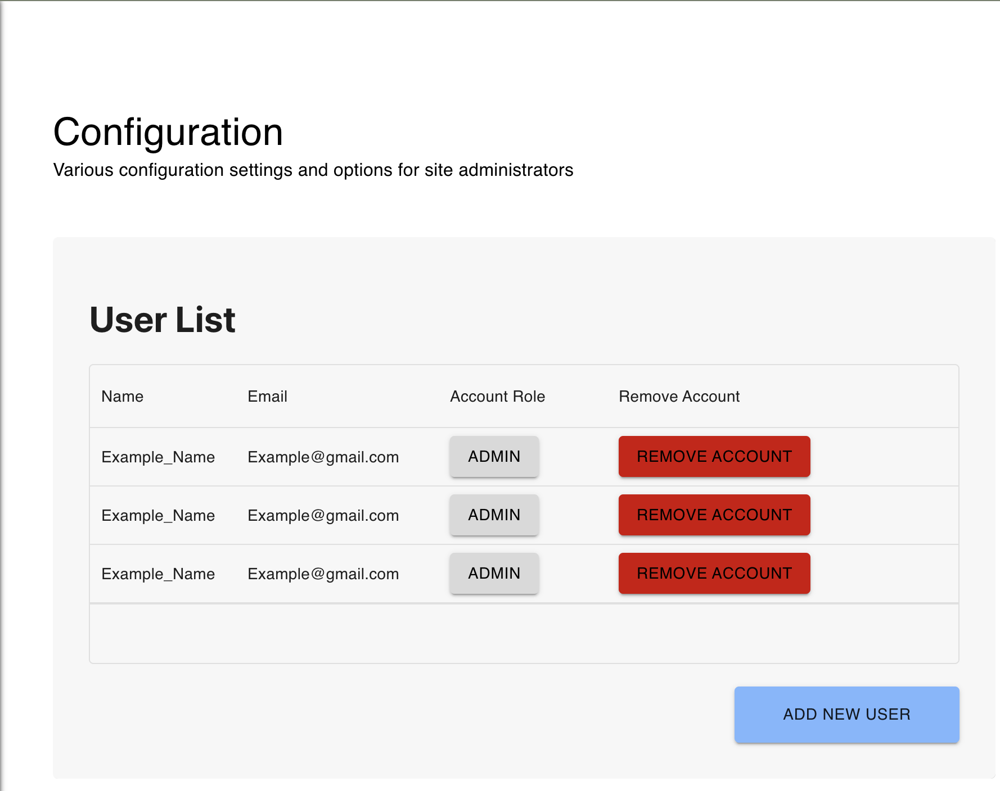

# Help for Administrators
## Add Events/Menus
- Make sure you are logged in!
- Navigate to "Home"
- Scroll down, click "Create a Slide"
- Choose "Menu" or "Event" depending on your needs
- Fill out the form
- Click "Create"
- Done!
## Editing Events/Menus
- Make sure you are logged in!
- Navigate to "Home"
- Scroll down, click "Edit slideshow"
- Choose the slide you would like to edit.
- Update any values
- Click "Save"
- Done!
## Deleting Events/Menus
- Follow the same steps as outlined in the editing instructions
- Click "Delete this slide"
- Done!
## User Management
- This application can support the creation of multiple user accounts.
- Users must be given one of the following roles:
    1. User
        - A user with this role can update content on the site, but not manage other users.
    1. Admin
        - A user with this role has full permissions to manage the content on the site as well as manage other users.
- When logged in as a user with the Admin role, navigate to "Configuration" to change and apply settings.
:

- Here you can see a list of users.
- Click the "Account Role" button to change the user from Admin to User, or the other way around.
- Use the "Remove Account" button to delete that user.
- Click "Add New User" to add a new user.